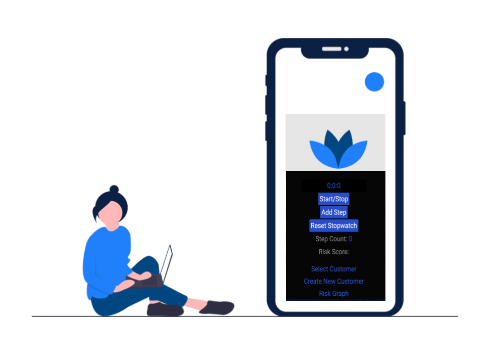
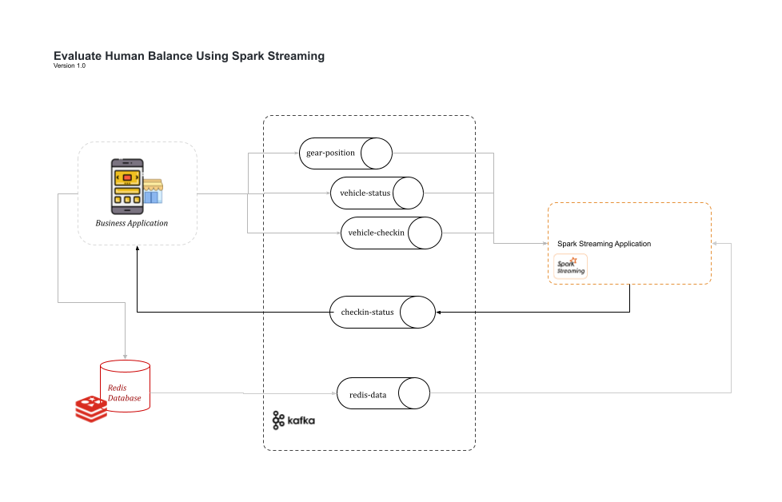

# Evaluate Human Balance Using Spark Streaming.

### Project Overview
You work for the data science team at STEDI, a small startup focused on assessing balance for seniors. STEDI has an application that collects data from seniors during a small exercise. The user logs in and then selects the customer they are working with. Then the user starts a timer and clicks a button with each step the senior takes. When the senior has reached 30 steps, their test is finished. The data transmitted enables the application to monitor seniors’ balance risk.


### A New Product Feature

Your product manager has requested a graph that shows fall risk (will they fall and become injured?) for recent assessments. The development team has built a graph, which is ready to receive risk information from Kafka:

### The Data
The STEDI data science team has configured some real-time data sources using Kafka Connect. One of those data sources is Redis. When a customer is first assessed in the STEDI application, their record is added to a sorted set called Customer in Redis. Redis is configured as a Kafka source and whenever any data is saved to Redis (including Customer information), a payload is published to the Kafka topic called redis-server.

### The Challenge

The application development team has programmed certain business events to be published automatically to Kafka. Whenever a customer takes an assessment, their risk score is generated, as long as they have four or more completed assessments. The risk score is transmitted to a Kafka topic called stedi-events as a JSON object with this format:
```commandline
{"customer":"Jason.Mitra@test.com","score":7.0,"riskDate":"2020-09-14T07:54:06.417Z"}
```
The application development team was not able to complete the feature as the graph is currently not receiving any data. Because the graph is currently not receiving any data, you need to generate a new payload in a Kafka topic and make it available to the STEDI application to consume



